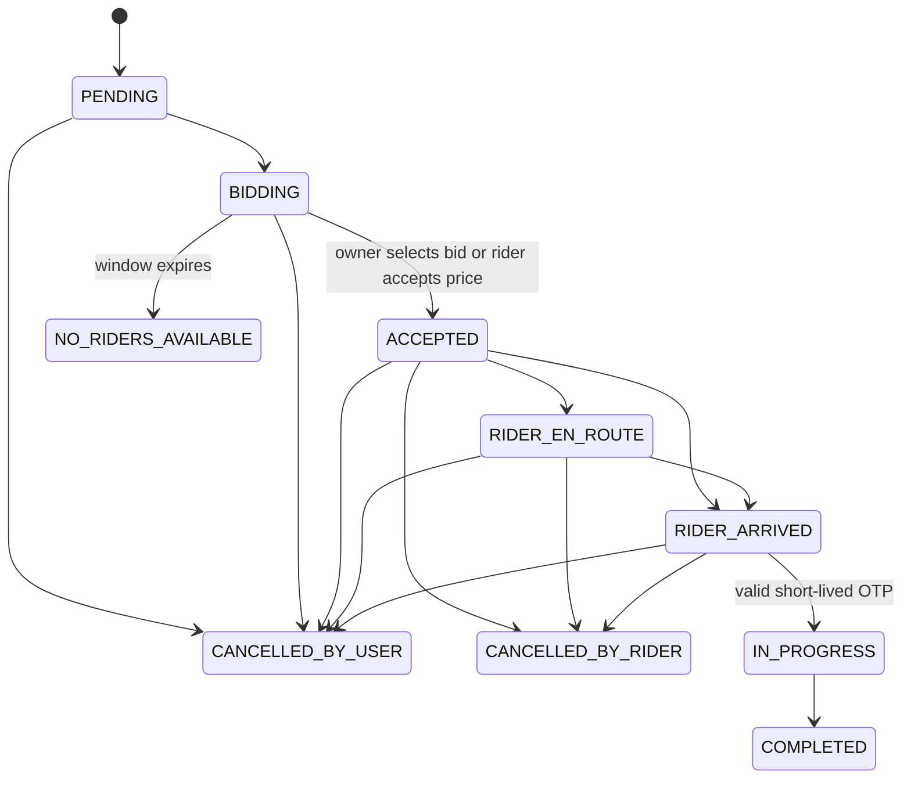
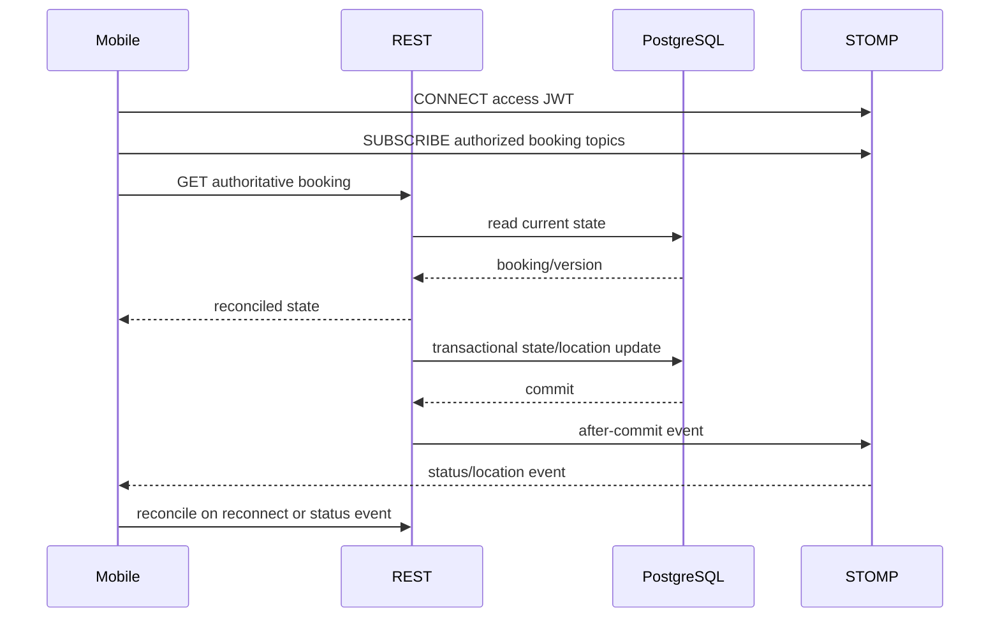

# Flux Architecture

## System overview

Flux is a modular monolith with three clients:

- Spring Boot 3 / Java 17 backend: REST, STOMP/WebSocket, business transactions, Firebase integration, notifications, and subscription records.
- PostgreSQL: authoritative users, riders, bookings, bids, notifications, complaints, chat, and payments.
- Redis and Kafka are provisioned by Compose but are not the authoritative booking state or the current STOMP broker.
- React Native `FluxUser`: customer booking, bidding, tracking, OTP, history, rating, and notifications.
- React Native `FluxRider`: availability, discovery, bids/direct acceptance, tracking, OTP, completion, earnings, history, and notifications.
- React/Vite admin dashboard: authenticated operational and management views.

## Booking lifecycle

`BookingStateMachine` enforces these transitions. Assignment locks the booking row and rider row in a transaction. The rider lock prevents one rider from accepting two bookings concurrently; the booking lock prevents multiple assignments. A unique `(booking_id, rider_id)` constraint prevents duplicate bids.

Lifecycle timestamps are stored on the booking, including `rider_en_route_at` added by the 2026-09-25 forward-only migration. The timeline API returns only events with persisted timestamps.

## Identity and authorization

Firebase verifies customer/rider identities. The backend obtains the canonical phone number from the verified Firebase token or Firebase user record. Client phone input is only a consistency assertion.

Flux JWTs contain `userId`, `role`, and `tokenType`. Access tokens authorize APIs and STOMP; refresh tokens are accepted only at `/api/auth/refresh`. The HTTP filter revalidates current account identity/status. Service methods enforce booking ownership and assigned-rider rules independently of the UI.

## Realtime model

REST/PostgreSQL is authoritative. STOMP supplies low-latency hints:

The simple broker uses 10-second heartbeats. Mobile clients reconnect exponentially up to 30 seconds with initial jitter, suppress duplicate event IDs, reject older booking versions, and retain a 30-second reconciliation poll. This broker is appropriate only for a single backend instance.

## Location

The rider app requests foreground permission and uses a battery-aware watch (30-second interval / 50-metre distance filter during an active ride). The backend validates coordinate ranges and limits writes to one every two seconds. Active-booking location publishes after commit. A location is considered fresh for UI/operations when not older than 30 seconds.

## Payments and earnings

Flux uses a flat rider subscription model. Completed ride fare is fully attributed to rider earnings; there is no ride commission. Stripe is disabled in the present implementation. An explicitly configured free/demo tier can create an idempotent server-side subscription record. Client confirmation cannot create a missing subscription. No live payment readiness is claimed.

## Deployment

Docker Compose provisions PostgreSQL, Redis, ZooKeeper/Kafka, backend, and Nginx. Production Spring configuration uses `ddl-auto=validate`; schema changes are applied through reviewed SQL under `infra/db/migrations`. CI compiles/tests the backend and builds the deployable image. Secrets remain environment/GitHub-secret inputs.
